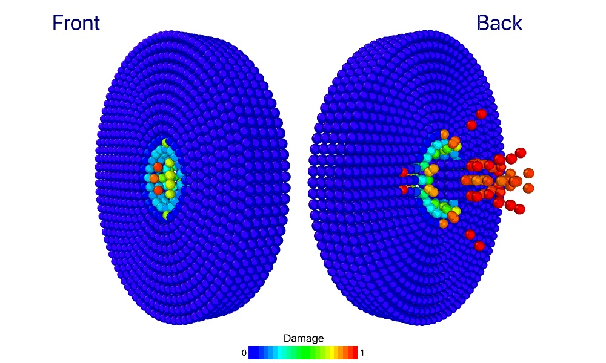

# Examples

## Tensile simulation of a bar

To simulate the tensile behavior of a bar using the PeriDyn package, you can follow these steps:

Activate the PeriDyn environment by running the following code from the PeriDyn package directory. This will activate the environment and install the required packages or install package first.
```julia
using Pkg
Pkg.activate(".")
Pkg.instantiate()
```
Import the PeriDyn and PDMaterialPoints packages.
```julia
using PeriDyn
using PDMaterialPoints
```

Create the geometry of the material block using a Cuboid shape and a specified resolution. Then create a material generator using the created geometry and resolution. In this example, we create a bar with dimensions 20x5x5 mm and a resolution of 0.5 mm.

See [Units in PeriDyn.jl](index.md#Units-in-PeriDyn.jl) for more information about units in PeriDyn.jl.

```julia
resolution = 0.5

x1, v1, y1, vol1, type1 = unpack(create(Cuboid([0 20; 0 5; 0 5]), resolution=resolution))  # mm
mat_gen1 = GeneralMaterial(y1, v1, x1, vol1, type1, 3.0*resolution; max_neigh=200)
```

Define the material parameters such as Young's modulus (Es), Poisson's ratio (nu), density (den), and critical stretch (cstretch). Then create a bond-based material block using the specified material parameters:
```julia
Es = 70 # GPa
nu = 0.15
K = Es/3/(1-2nu)
G = Es/2/(1+nu)
den = 2.2 * 1000.0 # Kg/m3
cstretch = 0.15

mat_spec1 = BondBasedSpecific([K], [cstretch], [den])
# mat_spec1 = OrdinaryStateBasedSpecific([K], [G], [cstretch], [den])

block1 = PeridynamicsMaterial(mat_gen1, mat_spec1)
```

Choose a solver for the simulation. In this example, we use the DSVelocityVerlet solver and set the number of steps (Steps), file write frequency (fwf), and neighbor update frequency (nuf):
```julia
solver = DSVelocityVerlet()
steps, fwf, nuf = 20000, 100, 10
```

Define the boundary conditions for the simulation. Here, we fix the left part of the bar (y1[1, :] .< 4.0) and move the right part of the bar (y1[1, :] .> 16.0) with a constant velocity:
```julia
dt = 1.0e-3
BC1 = FixBC(y1[1, :] .< 4.0)
vel = [0.2/steps/dt, 0.0, 0.0]
BC2 = MoveBC(y1[1, :] .> 16.0, vel)
```

Define a repulsive contact model. In this example, we use a LinearRepulsionModel with a spring constant (k) and the material block defined earlier (block1):
```julia
k = 1.0
RM1 = LinearSpringContactModel(k, block1; distanceX=3, max_neighs=200)
RMs = [RM1]
```

Create a PeriDyn environment by specifying the material blocks, repulsion models, boundary conditions, and time step (dt):
```julia
dt = 1e-3
env = PeriDyn.Env(1, [block1], RMs, [BC1, BC2], dt)
```

Customize the PeriDyn environment by setting parameters and defining a collection function. In this example, we set the "left" parameter to select the left part of the bar and collect the force values in the "Out" dictionary:
```julia
env.Params = Dict(:left => (env.y[1,:] .< 4))

env.Out = Dict(:Force => zeros(3, steps))

env.Collect! = function (env, step)
    env.Out[:Force][:, step] = sum(env.f[:, env.Params[:left]], dims=2)
end
```

Run the simulation using the `run!` function and specify the number of steps, solver, file write frequency, output directory, and start index. Additionally, write the simulation output to a JLD file or Ovito files for visualization:
```julia

out_dir = "./output/tensile_sim_BB/$(typeof(solver))"
run!([env], steps, solver;
    filewrite_freq=fwf, neigh_update_freq=nuf, average_prop_freq=100, out_dir=out_dir, start_at=0, ext=:data)

PeriDyn.write_data("$(out_dir)/env_Out.jld2"; Out=env.Out)

PeriDyn.jld2ovito("$(out_dir)/env_1_step_*.jld2", steps; start=0, step=fwf)
```

By following these steps, you can perform a tensile simulation of a bar using the PeriDyn package and visualize the results using Ovito.


## Ballistic impact simulation

To simulate the ballistic impact of a projectile on a plate using the PeriDyn package, you can follow these steps:



Activate the PeriDyn environment by running the following code from the PeriDyn package directory. This will activate the environment and install the required packages or install package first.
```julia
using Pkg
Pkg.activate(".")
```

Import the PeriDyn and PDMaterialPoints packages.
```julia
using PeriDyn
using PDMaterialPoints
```

Create the geometry of the material block for plate using a Disk shape and projectile using a Cuboid shape. Then create a material generator using the created geometry and resolution. In this example, we create a plate with radius 10 mm and thickness of 5 mm and a resolution of 0.5 mm. We also create a projectile with dimensions 5x5x5 mm and a resolution of 1.0 mm.

```julia
resolution = 1.0
horizon = 3.0*resolution

out1 = create(Disk(15, 5), resolution=resolution)  # mm
out2 = create(
            move(Cuboid([-2 2; -2 2; -2 2]),
                    by=[0, 0, 10.0]),
            resolution=resolution,
            type=2
            )
out2[:v][3, :] .= -0.1 # m/s

mat_gen1 = GeneralMaterial(out1, horizon; max_neigh=200)
mat_gen2 = GeneralMaterial(out2, horizon; max_neigh=200)
```

Define the material parameters such as Young's modulus (Es), Poisson's ratio (nu), density (den), and critical stretch (cstretch). Then create a bond-based material block using the specified material parameters:
```julia
Es = 70 # GPa
nu = 0.15
K = Es/3/(1-2nu)
G = Es/2/(1+nu)
den = 2.2 * 1000.0 # Kg/m3
cstretch = 0.05

mat_spec1 = BondBasedSpecific([K], [cstretch], [den])
mat_spec2 = BondBasedSpecific([100*K], [cstretch], [100*den])

# mat_spec1 = OrdinaryStateBasedSpecific([K], [G], [cstretch], [den])

block1 = PeridynamicsMaterial(mat_gen1, mat_spec1;
                                 name="Plate")
block2 = PeridynamicsMaterial(mat_gen2, mat_spec2;
                                 name="Projectile")
```

Choose a solver for the simulation. In this example, we use the DSVelocityVerlet solver and set the number of steps (Steps), file write frequency (fwf), and neighbor update frequency (nuf):
```julia
solver = DSVelocityVerlet()
steps, fwf, nuf = 20000, 100, 10
```

Define a contact model. In this example, we use a `LinearSpringContactModel` with a spring constant (k) and the material block defined earlier (block1):
```julia
k = 100*18K/pi/horizon^5
RM1 = LinearSpringContactModel(k, block1, block2; distanceX=3, max_neighs=200)
RM2 = LinearSpringContactModel(k, block1; distanceX=3, max_neighs=200)
RMs = [RM1, RM2]
```

Create a PeriDyn environment by specifying the material blocks, repulsion models, boundary conditions, and time step (dt):
```julia
dt = 1e-2
env = PeriDyn.Env(1, [block1, block2], RMs, [], dt)
```

Run the simulation using the `run!` function and specify the number of steps, solver, file write frequency, output directory, and start index. Additionally, write the simulation output to a JLD file or Ovito files for visualization.
```julia
out_dir = "./output/ballistic_impact_sim/$(typeof(solver))"
run!([env], steps, solver;
    filewrite_freq=fwf, neigh_update_freq=nuf,
    average_prop_freq=10,
    out_dir=out_dir, start_at=0, ext=:data)
```


