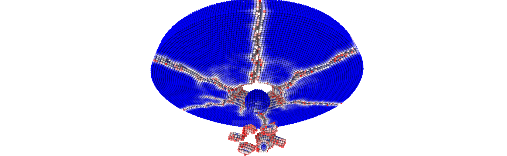

# PeriDyn



PeriDyn is a numerical simulation software designed to solve peridynamics problems. It is written in the Julia programming language, and offers a high level of flexibility and speed. PDBenchmark is built on top of the PeriDyn package, which provides a number of predefined material models and benchmark problems. This allows users to quickly set up and run simulations, and compare their results to established benchmarks.

!!! tip
    **Please see the [post](https://ravinderbhattoo.github.io/posts/peridyn) for more information about the PeriDyn.jl package.**


Peridynamics is a nonlocal continuum theory that can describe material failure and fracture without using the traditional concepts of stress and strain. Instead, it models a material as a collection of particles that interact through pairwise forces. These forces depend on the separation between particles, and can be used to simulate a wide range of materials, including brittle and ductile solids, fluids, and granular materials.

## Units in PeriDyn.jl
!!! tip
    Units are abstract, therefore user can use any unit system as long as it is consistent. PeriDyn.jl also provide support for quantity defined using Unitful.jl package. All calculation in PeriDyn.jl is checked for dimension consistency, as a result PriDyn.jl will throw error if dimension of a quantity is not correct. Provided units are changed to default units defined in PeriDyn.jl.

!!! warning
    Default behavior for environment construction is to use no units with all the quantities, which can be changed using keyword argument `units=true` in [`Env`](@ref) function. The performance of the code is better when no units are used.


## Table of contents

```@contents
Pages = [
            "examples.md",
            "materialgeometry.md",
            "mmodels.md",
            "cmodels.md",
            "bc.md",
            "solvers.md",
            "io.md",
            "list.md",
            "autodocs.md"
        ]
Depth = 3
```